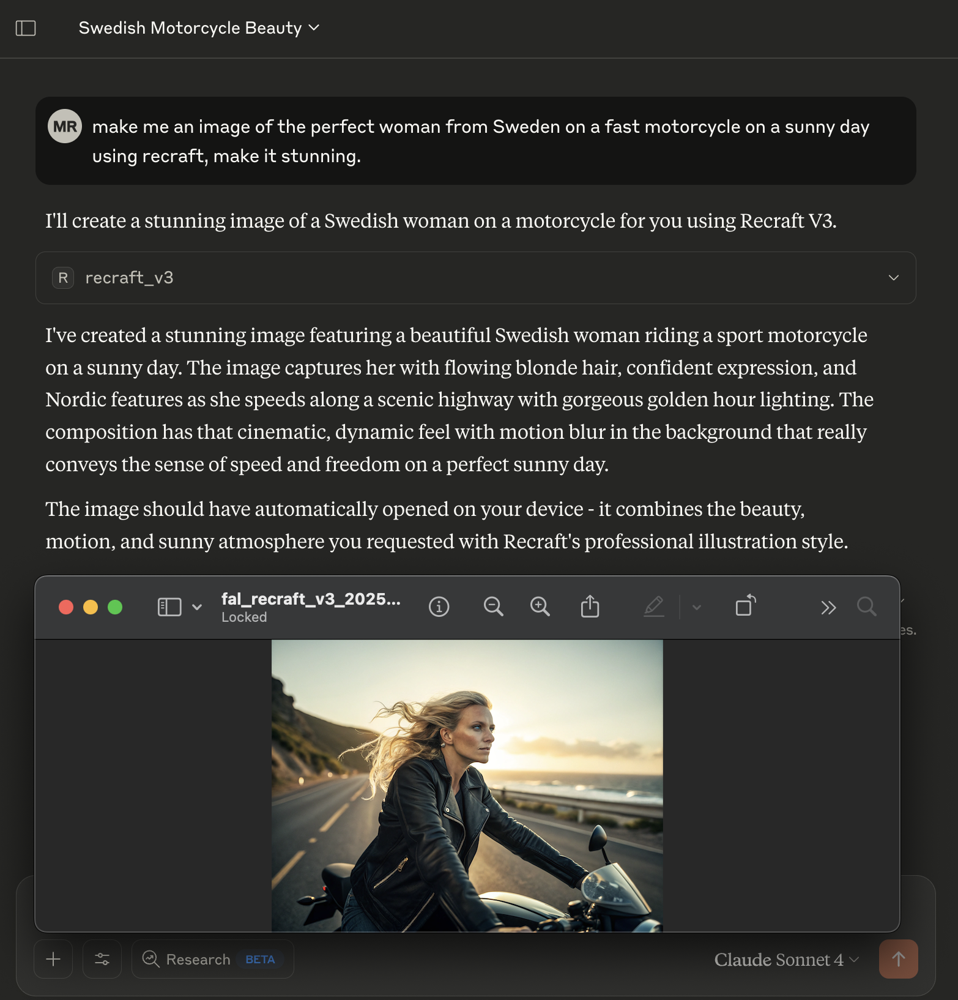
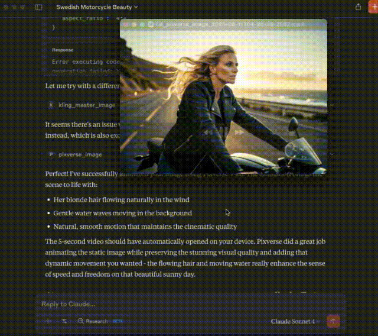

# FAL Image/Video MCP Server 🎨🎬

> **High-performance MCP server for FAL AI image and video generation with automatic downloads**

[](https://www.npmjs.com/package/fal-image-video-mcp)
[](https://nodejs.org/)
[](LICENSE)
[](https://www.typescriptlang.org/)
[](https://modelcontextprotocol.io/) 

Seamless bridge between FAL AI's powerful image and video generation capabilities and MCP-compatible clients like Claude. **All generated content is automatically downloaded to your local machine** while providing public URLs, data URLs, and local file paths.

**Make Images**


**Make Videos**


## 🚀 Claude Desktop Setup

### Quick Setup
1. **Get your FAL API key** from [fal.ai](https://fal.ai)
2. **Add to Claude Desktop configuration:**

```json
{
  "mcpServers": {
    "fal-image-video": {
      "command": "npx",
      "args": ["-y", "fal-image-video-mcp"],
      "env": {
        "FAL_KEY": "YOUR-FAL-AI-API-KEY"
      }
    }
  }
}
```

### Configuration File Locations
- **macOS**: `~/Library/Application Support/Claude/claude_desktop_config.json`
- **Windows**: `%APPDATA%/Claude/claude_desktop_config.json`
- **Linux**: `~/.config/Claude/claude_desktop_config.json`

### Optimized for Claude Desktop
```json
{
  "mcpServers": {
    "fal-image-video": {
      "command": "npx",
      "args": ["-y", "fal-image-video-mcp"],
      "env": {
        "FAL_KEY": "YOUR-FAL-AI-API-KEY",
        "DOWNLOAD_PATH": "/custom/download/path",
        "ENABLE_DATA_URLS": "true",
        "MAX_DATA_URL_SIZE": "1048576",
        "AUTOOPEN": "false"
      }
    }
  }
}
```

**Environment Variables:**
- `FAL_KEY` (required): Your FAL AI API key
- `DOWNLOAD_PATH` (optional): Custom download directory (defaults to ~/Downloads)
- `ENABLE_DATA_URLS` (optional): Enable/disable data URLs (default: false, optimized for Claude Desktop)
- `MAX_DATA_URL_SIZE` (optional): Max file size for data URLs in bytes (default: 2MB)
- `AUTOOPEN` (optional): Automatically open generated files with default application (default: true, cross-platform)

### Getting Your FAL API Key
1. Visit [fal.ai](https://fal.ai) and create an account
2. Navigate to your API keys section
3. Generate a new API key
4. Replace `YOUR-FAL-AI-API-KEY` with your actual key
5. Restart Claude Desktop

## 📥 Automatic Downloads

**All generated content is automatically saved to your local machine!**

### **Default Behavior:**
- **Images**: Downloaded as `.jpg` files
- **Videos**: Downloaded as `.mp4` files  
- **Location**: `~/Downloads` folder (or custom `DOWNLOAD_PATH`)
- **Naming**: `fal_{model}_{timestamp}_{index}.{ext}`

### **🎯 Claude Desktop Optimized Response:**
```json
{
  "images": [
    {
      "url": "https://fal-storage.../image.jpg",
      "localPath": "/Users/you/Downloads/fal_imagen4_2025-01-06T12-30-45-123Z.jpg",
      "width": 1024,
      "height": 1024
    }
  ],
  "download_path": "/Users/you/Downloads",
  "data_url_settings": {
    "enabled": false,
    "max_size_mb": 2,
    "note": "Data URLs disabled by default for Claude Desktop optimization"
  },
  "autoopen_settings": {
    "enabled": true,
    "note": "Files automatically opened with default application"
  }
}
```

**Why this works better for Claude Desktop:**
- ✅ **Local file paths** allow Claude to directly access downloaded images
- ✅ **No large data URLs** that overwhelm the context
- ✅ **Auto-open files** instantly display generated content in default applications
- ✅ **Public URLs** available for sharing if needed
- ✅ **Size limits** prevent context overflow

---

## ✨ Features

| **Category** | **Features** |
|---|---|
| 🎨 **Image Generation** | 8 curated models including Imagen 4, FLUX Kontext Pro, Ideogram V3 |
| 🎬 **Video Generation** | 7 text-to-video models including Veo 3, Kling 2.1 Master, Pixverse V4.5 |
| 🔄 **Image-to-Video** | 6 image-to-video models for animating static images |
| 📥 **Auto Downloads** | All content automatically saved locally with custom path support |
| 🔗 **Triple URL Support** | Public URLs, Data URLs, and Local file paths |
| 🚀 **Universal Execution** | Run any FAL model beyond the curated registry |
| 🌐 **Multi-Transport** | stdio (Claude Desktop) + HTTP/SSE (Smithery/Web) |
| 🔐 **Lazy Authentication** | Discover tools without API key, authenticate on use |
| ⚡ **Performance** | TypeScript implementation, async operations, error handling |

---

## 🚀 Version History

### Version 1.0.0
- ✅ Initial release with FAL AI integration
- ✅ Image generation with Flux models
- ✅ Video generation with Minimax
- ✅ Data URL conversion for MCP compatibility
- ✅ TypeScript support
- ✅ NPX deployment ready

### Coming Soon
- 🔜 Additional FAL models
- 🔜 Batch processing
- 🔜 Enhanced error handling
- 🔜 Performance optimizations

---


## 🏗️ Technical Architecture

| **Component** | **Technology** | **Purpose** |
|---|---|---|
| **Backend** | TypeScript + Node.js | Core server implementation |
| **AI Client** | @fal-ai/client | FAL API integration |
| **MCP SDK** | @modelcontextprotocol/sdk | MCP protocol compliance |
| **Transport** | stdio / HTTP + SSE | Multi-transport communication |
| **Build System** | TypeScript Compiler | Production builds |
| **Deployment** | npm / Docker / Smithery | Multiple deployment options |

---

## 📖 Usage

### Available Tools

## 🎨 Image Generation Models (8 Available)

The server dynamically loads the latest available models from FAL AI. Current models include:

#### `imagen4` - Imagen 4
Google's latest text-to-image model with superior quality.
```json
{
  "tool": "imagen4",
  "arguments": {
    "prompt": "A photorealistic mountain landscape at golden hour",
    "image_size": "landscape_16_9"
  }
}
```

#### `flux_kontext` - FLUX Kontext Pro
State-of-the-art prompt adherence and typography generation.
```json
{
  "tool": "flux_kontext",
  "arguments": {
    "prompt": "Modern logo design with the text 'AI Studio'",
    "num_inference_steps": 25
  }
}
```

#### `ideogram_v3` - Ideogram V3
Advanced typography and realistic outputs.
```json
{
  "tool": "ideogram_v3",
  "arguments": {
    "prompt": "Vintage poster with text 'Retro Café'",
    "negative_prompt": "blurry, low quality"
  }
}
```

#### `recraft_v3` - Recraft V3
Professional design and illustration capabilities.
```json
{
  "tool": "recraft_v3",
  "arguments": {
    "prompt": "Minimalist icon design for a mobile app",
    "image_size": "square_hd"
  }
}
```

#### Other Available Models:
- `stable_diffusion_35` - Stable Diffusion 3.5 Large
- `flux_dev` - FLUX Dev (High-quality 12B parameter model)
- `hidream` - HiDream I1 (High-resolution generation)
- `janus` - Janus (Multimodal understanding)

## 🎬 Image-to-Video Models (6 Available)

#### `kling_master_image` - Kling 2.1 Master I2V
Premium image-to-video conversion with motion fluidity.
```json
{
  "tool": "kling_master_image",
  "arguments": {
    "image_url": "https://example.com/landscape.jpg",
    "prompt": "Gentle wind blowing through the trees",
    "duration": 5
  }
}
```

#### `pixverse_image` - Pixverse V4.5 I2V
Advanced image-to-video with high quality output.
```json
{
  "tool": "pixverse_image",
  "arguments": {
    "image_url": "https://example.com/portrait.jpg",
    "prompt": "Person looking around and smiling",
    "aspect_ratio": "16:9"
  }
}
```

#### `wan_pro_image` - Wan Pro I2V
Professional image animation with effects.
```json
{
  "tool": "wan_pro_image",
  "arguments": {
    "image_url": "https://example.com/scene.jpg",
    "prompt": "Camera slowly panning across the scene"
  }
}
```

#### Other Available Models:
- `hunyuan_image` - Hunyuan I2V (Open-source)
- `vidu_image` - Vidu I2V (High-quality animation)
- `luma_ray2_image` - Luma Ray 2 I2V (Latest Luma)

## 📹 Text-to-Video Models (7 Available)

#### `veo3` - Veo 3
Google DeepMind's latest with speech and audio capabilities.
```json
{
  "tool": "veo3",
  "arguments": {
    "prompt": "A serene mountain lake with gentle ripples at sunrise",
    "duration": 10,
    "aspect_ratio": "16:9"
  }
}
```

#### `kling_master_text` - Kling 2.1 Master
Premium text-to-video with motion fluidity and cinematic quality.
```json
{
  "tool": "kling_master_text",
  "arguments": {
    "prompt": "A cat playing with a ball of yarn in slow motion",
    "duration": 6,
    "aspect_ratio": "16:9"
  }
}
```

#### `pixverse_text` - Pixverse V4.5
Advanced text-to-video generation with precise control.
```json
{
  "tool": "pixverse_text",
  "arguments": {
    "prompt": "Ocean waves crashing on a rocky shore at sunset",
    "duration": 8
  }
}
```

#### `luma_ray2` - Luma Ray 2
Latest Luma Dream Machine with enhanced capabilities.
```json
{
  "tool": "luma_ray2",
  "arguments": {
    "prompt": "A field of flowers swaying in the breeze",
    "aspect_ratio": "16:9"
  }
}
```

#### Other Available Models:
- `magi` - Magi (Creative video generation)
- `wan_pro_text` - Wan Pro (Professional video effects)
- `vidu_text` - Vidu Q1 (High-quality text-to-video)

## 🔄 Image-to-Video Workflow

**Yes!** You can absolutely pass generated images back to Claude and use them for video generation. Here's how:

1. **Generate an image** using any image model:
```json
{
  "tool": "imagen4",
  "arguments": {
    "prompt": "A majestic mountain landscape at sunset"
  }
}
```

2. **Use the returned image URL** in any image-to-video model:
```json
{
  "tool": "kling_master_image",
  "arguments": {
    "image_url": "<URL_FROM_PREVIOUS_GENERATION>",
    "prompt": "Gentle clouds moving across the sky",
    "duration": 5
  }
}
```

## 🔧 Advanced Model System

This MCP server features comprehensive model access:

### **📋 Model Discovery**
Use `list_available_models` to see all models in the registry:
```json
{
  "tool": "list_available_models",
  "arguments": {
    "category": "imageGeneration"
  }
}
```

### **🚀 Universal Model Execution**  
Use `execute_custom_model` to run ANY FAL endpoint beyond our registry:
```json
{
  "tool": "execute_custom_model",
  "arguments": {
    "endpoint": "fal-ai/custom-model-name",
    "input_params": {
      "prompt": "Your custom prompt",
      "custom_param": "value"
    },
    "category_hint": "image"
  }
}
```

### **✨ Smart Features:**
- ✅ **21 curated models** from actual FAL AI platform
- ✅ **Universal execution** for any FAL endpoint  
- ✅ **Automatic downloading** to ~/Downloads (configurable)
- ✅ **Triple URL support** (public + data + local file URLs)
- ✅ **Automatic categorization** by type
- ✅ **Dynamic tool generation** for each model
- ✅ **Model-specific parameter handling**

### **🎯 No Limitations:**
- Want to use a model not in our registry? Use `execute_custom_model`
- Need to see all available models? Use `list_available_models`  
- Want both curated experience AND full flexibility? You got it!

The MCP server provides both **public URLs** and **data URLs** for maximum compatibility with Claude and other clients.

### Response Format

Both tools return structured JSON with:
- **Public URL**: Direct link to the generated content
- **Data URL**: Base64-encoded data URL for direct embedding
- **Metadata**: Generation parameters and dimensions
- **Claude-compatible format**: Ready for immediate use in conversations

**Example Response:**
```json
{
  "model": "fal-ai/flux/schnell",
  "prompt": "A majestic dragon...",
  "images": [
    {
      "url": "https://storage.googleapis.com/fal-flux-storage/...",
      "dataUrl": "data:image/jpeg;base64,/9j/4AAQSkZJRgABAQAAAQ...",
      "width": 1024,
      "height": 768
    }
  ],
  "metadata": {
    "image_size": "landscape_4_3",
    "num_inference_steps": 4,
    "guidance_scale": 3.5
  }
}
```

## 🔧 Alternative Installation Methods

### 🌐 HTTP Server Mode (Standalone Testing)

**Start HTTP server for testing or integration:**
```bash
# Start on auto-detected port (default: 3000)
npx -y fal-image-video-mcp --http

# Or specify port via environment
PORT=8080 npx -y fal-image-video-mcp --http

# With custom transport flag
MCP_TRANSPORT=http npx -y fal-image-video-mcp
```

**HTTP Endpoints:**
- `GET /health` - Server health check
- `GET /mcp` - SSE endpoint for MCP communication  
- `POST /mcp` - JSON-RPC message handling

**Test the server:**
```bash
# Health check
curl http://localhost:3000/health

# List available tools
curl -X POST http://localhost:3000/mcp \
  -H "Content-Type: application/json" \
  -d '{"jsonrpc": "2.0", "id": 1, "method": "tools/list", "params": {}}'
```

### 🎯 Authentication in HTTP Mode

**Lazy Loading Support:**
- ✅ Server starts without FAL_KEY (for tool discovery)
- ✅ API key validated only when tools are invoked
- ✅ Clear error messages for missing authentication

**Set your FAL_KEY:**
```bash
# Via environment variable
FAL_KEY=your-api-key npx fal-image-video-mcp --http

# Or configure in your deployment platform
export FAL_KEY=your-api-key
npx fal-image-video-mcp --http
```

**Production deployment example:**
```dockerfile
# Dockerfile
FROM node:18-slim
ENV FAL_KEY=your-api-key
ENV PORT=3000
RUN npx -y fal-image-video-mcp --http
EXPOSE 3000
```

### 📱 NPX (One-time use)
```bash
# Stdio mode (Claude Desktop)
npx -y fal-image-video-mcp

# HTTP mode (Testing/Smithery)
npx -y fal-image-video-mcp --http
```

### 🔧 Global Installation
```bash
npm install -g fal-image-video-mcp

# Run in different modes
fal-image-video-mcp              # Stdio mode
fal-image-video-mcp --http       # HTTP mode
```

### 💻 From Source
```bash
git clone https://github.com/RamboRogers/fal-image-video-mcp.git
cd fal-image-video-mcp
npm install
npm run build

# Choose your transport
npm start                    # Stdio mode
npm start -- --http         # HTTP mode
```

---

## 📄 License

This project is licensed under the MIT License - see the [LICENSE](LICENSE) file for details.

[](LICENSE)

---

## 🌐 Connect

[](https://github.com/RamboRogers)
[](https://matthewrogers.org)
[](mailto:matt@matthewrogers.org)

**Created by Matthew Rogers** - Bringing AI creativity to MCP clients everywhere! 🚀